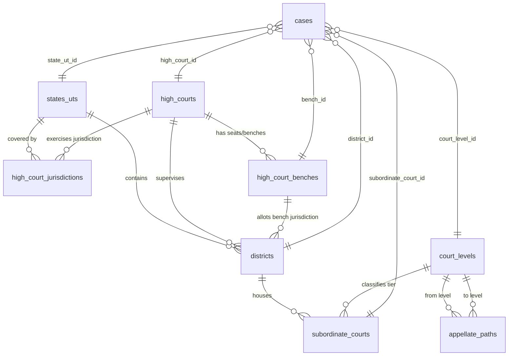
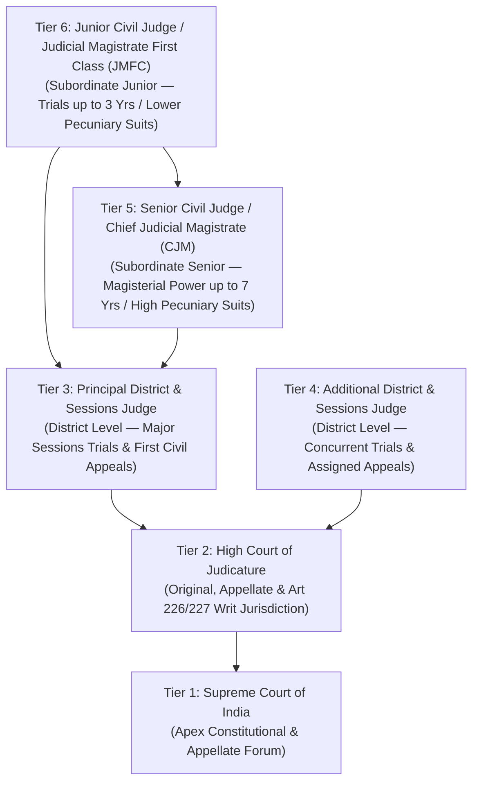

# JIS – Real Indian Judiciary Hierarchy Implementation

This document provides a comprehensive technical reference for the **Real Indian Judiciary Hierarchy** extension integrated into the **JIS (Judiciary Info System)** application.

---

## 1. Overview & Architectural Principles

The Indian Judiciary is an integrated, unified judicial system with the **Supreme Court of India** at the apex, 25 **High Courts** exercising constitutional and supervisory jurisdiction over States and Union Territories, and a hierarchical network of **Subordinate Courts** operating within Judicial Districts.

### Key Implementation Principles:
1. **Preservation of Existing JIS Architecture**:
   - Zero breaking changes to existing authentication, RBAC, case lifecycle states (`Filed`, `Allocated`, `In Trial`, `Judgement Pending`, `Closed`), E-Filings, Hearings, Documents, Notifications, or Vakalatnama workflows.
   - Preserves Node.js + Express.js + EJS + MySQL + Bootstrap 5 architecture.
2. **Normalized Database Design**:
   - Split across 8 dedicated tables (`states_uts`, `high_courts`, `high_court_jurisdictions`, `high_court_benches`, `districts`, `court_levels`, `subordinate_courts`, `appellate_paths`).
   - Extended the `cases` table safely with nullable foreign keys (`state_ut_id`, `high_court_id`, `bench_id`, `district_id`, `subordinate_court_id`, `court_level_id`).
3. **Real Geographic & Judicial Mappings**:
   - Accurate multi-jurisdiction High Courts (e.g. Bombay High Court covering Maharashtra, Goa, Dadra & Nagar Haveli and Daman & Diu; Calcutta High Court covering West Bengal and Andaman & Nicobar; Gauhati High Court covering Assam, Nagaland, Mizoram, Arunachal Pradesh; Punjab & Haryana High Court covering Punjab, Haryana, Chandigarh).
   - Accurate Principal Seats vs. Benches (e.g. Allahabad HC Principal Seat at Prayagraj vs. Lucknow Bench; Bombay HC at Mumbai, Nagpur, Aurangabad, Panaji; Rajasthan HC at Jodhpur vs. Jaipur Bench; Madhya Pradesh HC at Jabalpur, Gwalior, Indore; Karnataka HC at Bengaluru, Dharwad, Kalaburagi; Madras HC at Chennai, Madurai).
4. **Data-Driven Appellate Pathways**:
   - Statutory appeal routes driven by legislation (CPC, CrPC / BNSS, Family Courts Act, Commercial Courts Act, Constitution of India) computed dynamically rather than hardcoded in UI templates.
5. **Dynamic Cascading User Experience**:
   - Registrar Case Filing form (R1) features live AJAX-powered cascading dropdowns (`State/UT` &rarr; `High Court` &rarr; `Bench` &rarr; `District` &rarr; `Tier` &rarr; `Subordinate Court`) with real-time appellate pathway preview.

---

## 2. Normalized Database Schema



### 2.1 Table Definitions

1. `states_uts`:
   - `id`, `code` (e.g. 'UP', 'MH', 'DL'), `name`, `type` (`State` / `Union Territory`).
   - Seeded with all 36 States & UTs.
2. `high_courts`:
   - `id`, `code` (e.g. 'HC_ALLAHABAD', 'HC_BOMBAY'), `name`, `established_year`, `principal_seat_city`.
   - Seeded with all 25 High Courts.
3. `high_court_jurisdictions`:
   - `id`, `high_court_id`, `state_ut_id`, `is_primary`.
   - Links High Courts to one or multiple States/UTs.
4. `high_court_benches`:
   - `id`, `high_court_id`, `bench_name`, `bench_type` (`Principal Seat`, `Permanent Bench`, `Circuit Bench`), `city`.
   - Seeded with 41 Principal Seats and Benches.
5. `districts`:
   - `id`, `state_ut_id`, `high_court_id`, `bench_id`, `district_code`, `district_name`, `headquarters`.
   - Seeded with all 787 all-India Judicial Districts across all 36 States & UTs.
6. `court_levels`:
   - `id`, `level_code`, `level_name`, `tier_order` (1 to 6), `category` (`Apex`, `High Court`, `District Level`, `Subordinate Senior`, `Subordinate Junior`), `description`.
7. `subordinate_courts`:
   - `id`, `district_id`, `court_level_id`, `court_name`, `court_type` (`Civil`, `Criminal`, `Combined / Dual`, `Special`), `location`.
8. `appellate_paths`:
   - `id`, `case_category` (`Civil`, `Criminal`, `Constitutional`, `Family`, `Commercial`), `from_level_id`, `to_level_id`, `appeal_type`, `governing_statute`, `description`.
   - Seeded with 13 comprehensive statutory pathways.
9. `cases` (extended):
   - Added `state_ut_id`, `high_court_id`, `bench_id`, `district_id`, `subordinate_court_id`, `court_level_id` with foreign key constraints and `ON DELETE SET NULL`.

---

## 3. High Court & Bench Mapping Reference

| High Court | Principal Seat | Permanent / Circuit Benches | States / UTs Covered |
| :--- | :--- | :--- | :--- |
| **Allahabad High Court** | Prayagraj | Lucknow Bench | Uttar Pradesh |
| **Bombay High Court** | Mumbai | Nagpur, Aurangabad, Panaji (Goa) | Maharashtra, Goa, Dadra & Nagar Haveli and Daman & Diu |
| **Calcutta High Court** | Kolkata | Port Blair (Circuit), Jalpaiguri (Circuit) | West Bengal, Andaman and Nicobar Islands |
| **Gauhati High Court** | Guwahati | Kohima, Aizawl, Itanagar | Assam, Nagaland, Mizoram, Arunachal Pradesh |
| **Madhya Pradesh High Court**| Jabalpur | Gwalior, Indore | Madhya Pradesh |
| **Madras High Court** | Chennai | Madurai Bench | Tamil Nadu, Puducherry |
| **Rajasthan High Court** | Jodhpur | Jaipur Bench | Rajasthan |
| **Karnataka High Court** | Bengaluru | Dharwad, Kalaburagi | Karnataka |
| **Jammu & Kashmir and Ladakh** | Srinagar | Jammu Wing | Jammu and Kashmir, Ladakh |
| **Punjab and Haryana High Court** | Chandigarh | — | Punjab, Haryana, Chandigarh |
| **High Court of Delhi** | New Delhi | — | NCT of Delhi |
| **High Court of Kerala** | Ernakulam | — | Kerala, Lakshadweep |
| **Patna High Court** | Patna | — | Bihar |
| **High Court of Gujarat** | Ahmedabad | — | Gujarat |
| **High Court of Telangana** | Hyderabad | — | Telangana |
| **High Court of Andhra Pradesh**| Amaravati | — | Andhra Pradesh |
| **High Court of Meghalaya** | Shillong | — | Meghalaya |
| *(and all other 8 High Courts)* | Respective Capitals | — | Chhattisgarh, HP, Jharkhand, Manipur, Odisha, Sikkim, Tripura, Uttarakhand |

---

## 4. Indian Judicial Court Tiers & Hierarchy



---

## 5. Statutory Appellate Pathways

### 5.1 Civil Jurisdiction
1. **Tier 6 (Junior Civil Judge) &rarr; Tier 5 (Senior Civil Judge / District Judge)**:
   - *Regular First Appeal* under **Section 96 of CPC, 1908** based on statutory pecuniary valuation.
2. **Tier 5 (Senior Civil Judge) &rarr; Tier 3 (Principal District Judge)**:
   - *Regular First Appeal (RFA)* under **Section 96 & Order XLI of CPC, 1908** on questions of fact and law.
3. **Tier 3 (District Court) &rarr; Tier 2 (High Court)**:
   - *Second Appeal* under **Section 100 of CPC, 1908** lying strictly on a **Substantial Question of Law**, or *First Appeal* under Section 96 against original decree.
4. **Tier 2 (High Court) &rarr; Tier 1 (Supreme Court of India)**:
   - *Special Leave Petition (Civil)* under **Article 136 of the Constitution of India** or *Civil Appeal* under Article 133.

### 5.2 Criminal Jurisdiction
1. **Tier 6 (JMFC) &rarr; Tier 3 (Court of Session)**:
   - *Criminal Appeal against Conviction* under **Section 374(3) of CrPC, 1973 / BNSS**.
2. **Tier 5 (CJM / CMM) &rarr; Tier 3 (Court of Session)**:
   - *Criminal Appeal against Sentence / Order* under **Section 374(3) of CrPC, 1973 / BNSS**.
3. **Tier 3 (Sessions Court) &rarr; Tier 2 (High Court)**:
   - *Criminal Appeal* under **Section 374(2) of CrPC, 1973 / BNSS** where sentence exceeds 7 years imprisonment. Mandatory *Capital Punishment Confirmation* under **Section 366 of CrPC**.
4. **Tier 2 (High Court) &rarr; Tier 1 (Supreme Court of India)**:
   - *Special Leave Petition (Criminal)* under **Article 136 of the Constitution** or *Criminal Appeal* under Article 134.

### 5.3 Family, Constitutional & Commercial Pathways
- **Family**: Family Court &rarr; High Court Division Bench (*Section 19, Family Courts Act, 1984*) &rarr; Supreme Court of India (*Article 136*).
- **Constitutional**: High Court (*Articles 226/227*) &rarr; Supreme Court of India (*Articles 132 & 136*).
- **Commercial**: Commercial Court / Division &rarr; Commercial Appellate Division of High Court (*Section 13, Commercial Courts Act, 2015*) &rarr; Supreme Court of India (*Article 136*).

---

## 6. API Endpoints

Mounted at `/api/hierarchy`:

| Method | Endpoint | Query Parameters | Description |
| :--- | :--- | :--- | :--- |
| `GET` | `/api/hierarchy/states` | — | Returns all 36 States and UTs |
| `GET` | `/api/hierarchy/high-courts` | `state_ut_id` (optional) | Returns High Courts covering state, or all 25 |
| `GET` | `/api/hierarchy/benches` | `high_court_id` | Returns Principal Seat and Benches |
| `GET` | `/api/hierarchy/districts` | `state_ut_id`, `high_court_id`, `bench_id` | Returns filtered judicial districts |
| `GET` | `/api/hierarchy/court-levels` | — | Returns all 6 judicial tiers |
| `GET` | `/api/hierarchy/subordinate-courts`| `district_id`, `court_level_id` | Returns subordinate court establishments |
| `GET` | `/api/hierarchy/appellate-path` | `category`, `court_level_id` | Returns full statutory appellate chain |

---

## 7. Migration & Verification Commands

```bash
# 1. Run migration to add tables and extend cases table
node database/migrate_hierarchy.js

# 2. Seed Indian Judiciary hierarchy data and map seed cases
npm run db:seed:hierarchy

# 3. Run hierarchy integration verification suite
node test_hierarchy_integration.js

# 4. Run full regression test suite (25 test cases across all modules)
node test_full_suite.js
```
